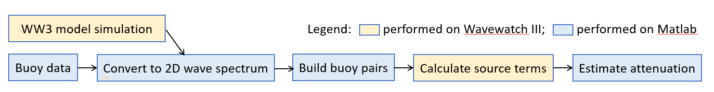

# Wave Attenuation in the Marginal Ice Zone

This repository is used to estimate wave attenuation coefficients in the marginal ice zone.  
The resulting paper is:  **Wave Attenuation by Sea Ice in the Marginal Ice Zone: Insights from Four Campaigns near Svalbard**  (URL: [www.temp.com](http://www.temp.com))

---

## Data Availability

Four datasets collected by OpenMetBuoy are used, including:  
- 202007  
- 202102  
- AWI UTOKYO  
- CHALMERS  

For detailed descriptions of these campaigns, please refer to:  
- Rabault et al. (2023)  
- Rabault et al. (2024)

The data is also available on other GitHub repositories:  
- [[URL1](https://github.com/jerabaul29/data_release_sea_ice_drift_waves_in_ice_marginal_ice_zone_2022)](#)  
- [URL2](#)

---

## Workflow

*Here attach a figure illustrating the workflow.*

  
